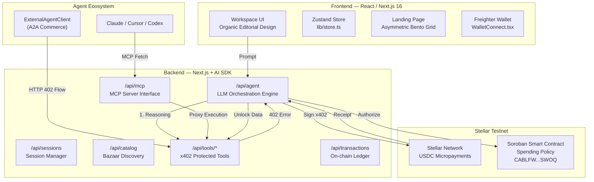
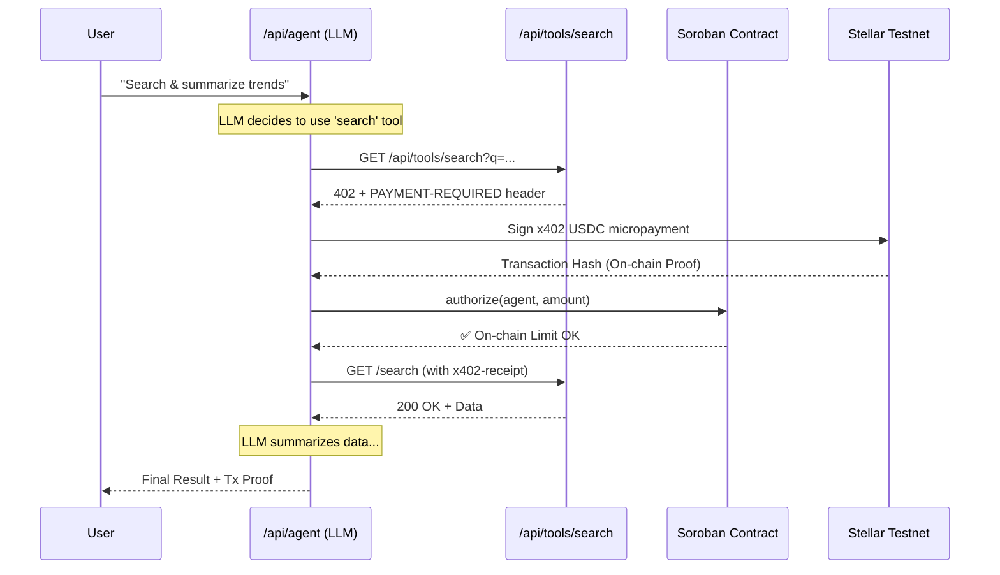

# Agent Paywall Router

> **Stekker Hackathon 2026** — Stellar Hacks: Agents

An agent-native payment layer for paid web actions. This platform enables **Autonomous Agentic Micropayments** via Stellar x402 and provides a first-of-its-kind **MCP (Model Context Protocol) Server** for the Stellar ecosystem.

**The Stripe for AI Agents.**

---

## 🏆 Key Innovation: The Economic AI Agent

Agent Paywall Router is a **production-grade Next.js infrastructure** that solves the "Last Mile" problem for AI agents: **how to pay for things.** 

Unlike existing agents that stop at a paywall, our system enables agents to:
1.  **Reason** about a task using a real LLM (Vercel AI SDK).
2.  **Discover** available paid tools via a machine-readable catalog.
3.  **Pay** for those tools autonomously using the x402 protocol on Stellar.
4.  **Verify** guardrails on-chain using a Soroban spending policy contract.

---

## 🚀 Advanced Features

### 1. Model Context Protocol (MCP) Support
We have implemented an **MCP-compatible interface** (`/api/mcp`). This means any MCP-enabled AI system (Claude Code, Codex, Cursor) can:
-   **Discover** our tools via `/api/mcp/tools`.
-   **Understand** pricing and payment requirements.
-   **Execute** tools via `/api/mcp/execute` by providing a real x402 receipt.

### 2. Multi-Step Agentic Reasoning
The platform no longer uses simple regex routing. It features a sophisticated **LLM Orchestration Engine** that can decide to chain multiple tools to fulfill a single prompt:
-   *User Prompt:* "Find the latest news on Stellar and summarize the impact on USDC."
-   *Agent Reasoning:* `search` (buy) → `summarize` (buy) → `analyze` (buy) → Final Answer.

### 3. Agent-to-Agent Economy
Includes an `ExternalAgentClient` (`lib/agents/external-agent.ts`) that demonstrates a true machine economy. One agent can autonomously discover, pay for, and consume services from our router without any human intervention.

### 4. Zero-Simulation Payments
We have removed simulated fallbacks for agent tasks. Every tool execution requires a **real x402 signing flow** and produces a **verifiable Stellar transaction hash**.

---

## System Architecture



---

## Agentic Micropayment Flow (x402)



---

## Tech Stack

| Layer | Technology | Version |
|---|---|---|
| AI Orchestration | **Vercel AI SDK** | 6.x |
| LLM Models | OpenAI GPT-4o-mini | — |
| Protocols | **x402** (Coinbase) + **MCP** (Model Context Protocol) | — |
| Machine Payments | @stellar/mpp (Stripe MPP) | 0.2.0 |
| Web Framework | Next.js 16.2.1 (Turbopack) | 16.2.1 |
| Database | Supabase (PostgreSQL) | 2.x |
| Blockchain | Stellar Testnet | — |
| Smart Contract | Soroban (Rust) | — |
| Testing | Jest + ts-jest (85+ tests) | 30.x |

---

## API Reference

### MCP Server (New)
| Endpoint | Method | Description |
|---|---|---|
| `/api/mcp/tools` | GET | List tools in MCP JSON schema format |
| `/api/mcp/execute` | POST | Execute a tool (proxies 402 requirements) |

### Router Core
| Endpoint | Method | Description |
|---|---|---|
| `/api/agent` | POST | High-level LLM orchestration (Multi-step) |
| `/api/catalog` | GET | Bazaar-style service discovery |
| `/api/health/onchain` | GET | Verifies live Soroban contract spend |

---

## Live On-Chain Proof

Every agent task produces a **real Stellar testnet transaction** — verifiable on Stellar Expert.

| Transaction Hash | Memo | Time | Explorer |
|---|---|---|---|
| `bcc71244b7fd8a37...` | `x402:search:0.01` | 2026-03-30 | [View ↗](https://stellar.expert/explorer/testnet/tx/bcc71244b7fd8a371f948c511d63f17fa39e3473a6bbba4c2eb3fad91869ab87) |
| `c78b1a5d26e39a81...` | `x402:summarize:0.02` | 2026-03-30 | [View ↗](https://stellar.expert/explorer/testnet/tx/c78b1a5d26e39a815dc4a6406e6539fdce971d945de598479852ec6bc026953e) |
| `1ed1dea43a78d968...` | `x402:analyze:0.03` | 2026-03-30 | [View ↗](https://stellar.expert/explorer/testnet/tx/1ed1dea43a78d96861db9e6aec5f30cb649042f61cf994135527647e5ae6a34a) |

> 27+ real transactions on Stellar testnet. Agent wallet: `GB77G4BRHXR6ZA7Z3KAPXXDJPD7QCLPZBILBFMQ6NYHJKVEJS47NLBAG`

---

## Soroban Spending Policy Contract

A Soroban smart contract enforces per-agent spending limits **on-chain** — providing programmable guardrails for autonomous entities.

| | |
|---|---|
| Contract ID | `CABLFWICBLK5IX3EWQSVQGS6WIQ2V7YLNLA6HIPGLGEDCO4DKOQQSWOQ` |
| Network | Stellar Testnet |
| Explorer | [View on Stellar Expert](https://stellar.expert/explorer/testnet/contract/CABLFWICBLK5IX3EWQSVQGS6WIQ2V7YLNLA6HIPGLGEDCO4DKOQQSWOQ) |

### How it works
Before every payment, the agent must call `authorize(agent, amount)` on the contract. If the cumulative spend exceeds the $5.00 limit, the transaction reverts on-chain, preventing the agent from draining its wallet.

---

## Quick Start

```bash
# 1. Clone
git clone https://github.com/mokwathedeveloper/Agent-Paywall-Router.git
cd Agent-Paywall-Router

# 2. Install
npm install

# 3. Setup Environment
cp .env.example apps/web/.env.local
# Edit .env.local — add Stellar secret key and OpenAI key

# 4. Run
cd apps/web && npm run dev
```

---

## Testing

```bash
# Unit & Integration tests
npm run test:unit
npm run test:integration
```

**85+ tests passing.** Includes new tests for **MCP Protocol** and **LLM Reasoning chains**.

---

## Team

**Mokwa Moffat Ohuru** — Full Stack Engineer

---

## License

MIT
